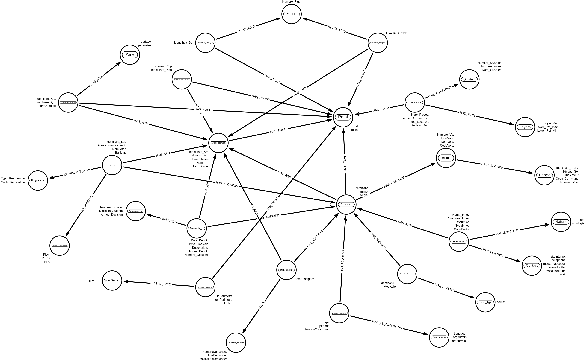

# Neo4j Housing Project

## Welcome

To get started , clone this repo.
This is a graph oriented database project made with Neo4j.
We gathered 16 datasets and obtained the following modeling: 



## Project

You can dowwnload and install Neo4j here : https://neo4j.com/download/
After that you can create your Neo4J project with the dump file
found here : https://drive.google.com/file/d/11VK50jtd1dVR4DrWM7JoPNU3f-KX57Sy/view?usp=sharing

Or you can run the following commands :

Don't forget to import the csv files located in the Data folder of this repository before starting

### Create Constraint

```
CREATE CONSTRAINT ON (ad:Adresse) ASSERT ad.Name_Adr IS UNIQUE ;
CREATE CONSTRAINT ON (ard:Arrondissement) ASSERT ard.Numero_Ard IS UNIQUE ;
CREATE CONSTRAINT ON (ard:Arrondissement) ASSERT ard.NumeroInsee IS UNIQUE ;
CREATE CONSTRAINT ON (vo:Voie) ASSERT vo.Numero_Vo IS UNIQUE ;
CREATE CONSTRAINT ON (po:Point) ASSERT po.point IS UNIQUE ;
CREATE CONSTRAINT ON (bp:Batiment_Protg) ASSERT bp.Identifiant_Bp IS UNIQUE ;
CREATE CONSTRAINT ON (pa:Parcelle) ASSERT pa.Numero_Par IS UNIQUE ;
CREATE CONSTRAINT ON (epp:Particulier_Protg) ASSERT epp.Identifiant_Epp IS UNIQUE ;
CREATE CONSTRAINT ON (qa:Quartier_Admin) ASSERT qa.Identifiant_Qa IS UNIQUE ;
CREATE CONSTRAINT ON (evp:Espace_Vert_Protg) ASSERT evp.Identifiant_Plan IS UNIQUE ;
CREATE CONSTRAINT ON (qu:Quartier) ASSERT qu.Numero_Quartier IS UNIQUE ;
CREATE CONSTRAINT ON (ly:Loyer) ASSERT (ly.Loyer_Ref,ly.Loyer_Ref_Min) IS NODE KEY ;
CREATE CONSTRAINT ON (lcf:Logement_Soc) ASSERT (lcf.Identifiant_Lcf,lcf.NbreTotal,lcf.Bailleur) IS NODE KEY;
CREATE CONSTRAINT ON (cf:Categorie_Financement) ASSERT (ly.Loyer_Ref,ly.Loyer_Ref_Min) IS NODE KEY ;
CREATE CONSTRAINT ON (du:Demande_Urbanisme) ASSERT (du.Numero_Dossier,du.Annee_Depot) IS NODE KEY ;
CREATE CONSTRAINT ON (au:Autorisation_Urbanisme) ASSERT (au.Numero_Dossier,au.Annee_Decision) IS NODE KEY ;
CREATE CONSTRAINT ON (na:Nature) ASSERT na.Etat IS UNIQUE ;
CREATE CONSTRAINT ON (co:Contact) ASSERT co.Mail IS UNIQUE ;
CREATE CONSTRAINT ON (en:Enseigne) ASSERT en.nomEnseigne IS UNIQUE ;
CREATE CONSTRAINT ON (dt:Demande_Terrasse) ASSERT dt.NumeroDemande IS UNIQUE;

```

### Create Node and RelationShip

```
 :auto USING PERIODIC COMMIT
LOAD CSV WITH HEADERS FROM "file:///arrondissements.csv" AS line FIELDTERMINATOR';'
 
MERGE(ard:Arrondissement {Identifiant_Ard:line.`Identifiant séquentiel de l’arrondissement`, Numero_Ard:line.`Numéro d’arrondissement`, NumeroInsee:line.`Numéro d’arrondissement INSEE`, Nom_Arr:line.`Nom de l’arrondissement`, NomOfficiel:line.`Nom officiel de l’arrondissement`})
 
MERGE(po:Point{point:point({latitude:toFloat(split(line.`Geometry X Y`,',') [0]),longitude:toFloat(split(line.`Geometry X Y`,',')[1])} ) })
 
MERGE(ard)-[:HAS_POINT]->(po)

:auto USING PERIODIC COMMIT
LOAD CSV WITH HEADERS FROM "file:///troncon_voie.csv" AS line FIELDTERMINATOR';'
FOREACH(uselessVar IN CASE WHEN (line.B_VOIEDUP) <> "" THEN [1] ELSE [] END |
MERGE(tv:Troncon{Identifiant_Tronc:line.N_SQ_TV, Niveau_Sol:line.C_NIVEAU, Indicateur:line.B_VOIEDUP, Code_Commune:line.C_COINSEE,Numero_Vo:line.N_SQ_VO})
)

:auto USING PERIODIC COMMIT
LOAD CSV WITH HEADERS FROM "file:///voie.csv" AS line FIELDTERMINATOR';'
 
FOREACH(uselessVar IN CASE WHEN (line.C_DESI) <> "" THEN [1] ELSE [] END |
MERGE(vo:Voie{Numero_Vo:line.N_SQ_VO,TypeVoie:line.C_DESI,NomVoie:line.L_LONGMIN ,CodeVoie:line.C_VOIE_VP})
)

MATCH (vo:Voie), (tv:Troncon)
WHERE vo.Numero_Vo = tv.Numero_Vo
MERGE(vo)-[:HAS_SECTION]->(tv)
RETURN vo,tv 

:auto USING PERIODIC COMMIT
LOAD CSV WITH HEADERS FROM "file:///adresse.csv" AS line FIELDTERMINATOR';'
 
FOREACH(uselessVar IN CASE WHEN (line.L_ADR) <> "" THEN [1] ELSE [] END |
MERGE(ad:Adresse{identifiant:line.N_SQ_AD,Name_Adr:line.L_ADR, Angle:line.B_ANGLE})
FOREACH(uselessVar IN CASE WHEN (line.C_AR) <> "" THEN [1] ELSE [] END |
MERGE(ard:Arrondissement{Numero_Ard:line.C_AR})
MERGE(ad)-[:HAS_ARD]->(ard)
)
FOREACH(uselessVar IN CASE WHEN (line.`Geometry X Y`) <> "" THEN [1] ELSE [] END |
MERGE(po:Point{point:point({latitude:toFloat(split(line.`Geometry X Y`,',') [0]),longitude:toFloat(split(line.`Geometry X Y`,',')[1])} ) })
MERGE(ad)-[:HAS_POINT]->(po)
)
FOREACH(uselessVar IN CASE WHEN (line.N_SQ_VO) <> "" THEN [1] ELSE [] END |
MERGE(vo:Voie{Numero_Vo:line.N_SQ_VO})
MERGE(ad)-[:HAS_FOR_WAY]->(vo)
)
)

:auto USING PERIODIC COMMIT
LOAD CSV WITH HEADERS FROM "file:///batiments-proteges.csv" AS line FIELDTERMINATOR';'
 
MERGE(bp:Batiment_Protg {Identifiant_Bp:line.N_SQ_SPVP})
MERGE(pa:Parcelle {Numero_Par:line.N_SQ_PC})
MERGE(po:Point{point:point({latitude:toFloat(split(line.`Geo Point`,',') [0]),longitude:toFloat(split(line.`Geo Point`,',')[1])} ) })
MERGE(bp)-[:HAS_POINT]->(po)
MERGE(bp)-[:IS_LOCATED]->(pa)

:auto USING PERIODIC COMMIT
LOAD CSV WITH HEADERS FROM "file:///elements-particuliers-proteges.csv" AS line FIELDTERMINATOR';'
 
MERGE(epp:Particulier_Protg{Identifiant_Epp:line.N_SQ_EPP})
MERGE(pa:Parcelle {Numero_Par:line.N_SQ_PC})
MERGE(ard:Arrondissement{Numero_Ard:line.N_SQ_CA})
MERGE(po:Point{point:point({latitude:toFloat(split(line.`geo_point_2d`,',') [0]),longitude:toFloat(split(line.`geo_point_2d`,',')[1])} ) })
MERGE(epp)-[:HAS_POINT]->(po)
MERGE(epp)-[:HAS_ARD]->(ard)
MERGE(epp)-[:IS_LOCATED]->(pa)

:auto USING PERIODIC COMMIT
LOAD CSV WITH HEADERS FROM "file:///quartier_paris.csv" AS line FIELDTERMINATOR';'
 
MERGE(qa:Quartier_Admin{Identifiant_Qa:line.N_SQ_QU,numInsee_Qa:line.C_QUINSEE,nomQuartier:line.L_QU})
MERGE(ar:Aire {surface_aire:line.SURFACE,perimetre:line.PERIMETRE})
MERGE(ard:Arrondissement{Numero_Ard:line.C_AR})
MERGE(po:Point{point:point({latitude:toFloat(split(line.`Geometry X Y`,',') [0]),longitude:toFloat(split(line.`Geometry X Y`,',')[1])} ) })
MERGE(qa)-[:HAS_POINT]->(po)
MERGE(qa)-[:HAS_ARD]->(ard)
MERGE(qa)-[:HAS_AREA]->(ar)

:auto USING PERIODIC COMMIT
LOAD CSV WITH HEADERS FROM "file:///espaces-verts-proteges.csv" AS line FIELDTERMINATOR';'
 
MERGE(evp:Espace_Vert_Protg{Identifiant_Plan:line.TEXTE,Numero_Evp:line.NUMEVP})
MERGE(ard:Arrondissement{Numero_Ard:line.N_SQ_CA})
MERGE(po:Point{point:point({latitude:toFloat(split(line.`geo_point_2d`,',') [0]),longitude:toFloat(split(line.`geo_point_2d`,',')[1])} ) })
MERGE(evp)-[:HAS_POINT]->(po)
MERGE(evp)-[:HAS_ARD]->(ard)

:auto USING PERIODIC COMMIT
LOAD CSV WITH HEADERS FROM "file:///logement-encadrement.csv" AS line FIELDTERMINATOR';'
MERGE(lo:Logement_Enc{Nbre_Pieces:line.`Nombre de pièces principales`, Epoque_Construction:line.`Epoque de construction`, Type_Location:line.`Type de location`,Secteur_Geo:rand()})
MERGE(qu:Quartier{Numero_Quartier:line.`Numéro du quartier`, Numero_Insee:line.`Numéro INSEE du quartier`, Nom_Quartier:line.`Nom du quartier`})
MERGE(ly:Loyer{Loyer_Ref:line.`Loyers de référence`, Loyer_Ref_Max:line.`Loyers de référence majorés`, Loyer_Ref_Min:line.`Loyers de référence minorés`})
MERGE(po:Point{point:point({latitude:toFloat(split(line.`geo_point_2d`,',') [0]),longitude:toFloat(split(line.`geo_point_2d`,',')[1])} ) })
MERGE(lo)-[:HAS_POINT]->(po)
MERGE(lo)-[:HAS_A_DISTRICT]->(qu)
MERGE(lo)-[:HAS_RENT]->(ly)

:auto USING PERIODIC COMMIT
LOAD CSV WITH HEADERS FROM "file:///logements-sociaux.csv" AS line FIELDTERMINATOR';'
 
MERGE(lsf:Logement_Soc{Identifiant_Lcf:line.`Identifiant livraison`, Annee_Financement:line.`Année du financement - agrément`, NbreTotal:line.`Nombre total de logements financés`, Bailleur:line.`Bailleur social`})
 
 
MERGE(pr:Programme{Type_Programme:line.`Nature de programme`, `Mode_Réalisation`:line.`Mode de réalisation`})
 
MERGE(cf:Categorie_Financement{PLAI:COALESCE(line.`Dont nombre de logements PLA I`,'Null'),PLUS:COALESCE(line.`Dont nombre de logements PLUS`,'Null'),PLS:COALESCE(line.`Dont nombre de logements PLS`,'Null')})
 
MERGE(ard:Arrondissement{Numero_Ard:line.Arrondissement})
MERGE(adr:Adresse{Name_Adr:line.`Adresse du programme`})
 
MERGE(lsf)-[:COMPLIANT_WITH]->(pr)
MERGE(lsf)-[:AS_FUNDING]->(cf)
MERGE(lsf)-[:HAS_ARD]->(ard)
MERGE(lsf)-[:HAS_ADDRESS]->(adr)

:auto USING PERIODIC COMMIT
LOAD CSV WITH HEADERS FROM "file:///autorisations-durbanisme-h.csv" AS line FIELDTERMINATOR';'
 
MERGE(du:Demande_Urbanisme{Numero_Dossier:line.`Numéro dossier`,Date_Depot:line.`Date dépôt`,Type_Dossier:line.`Type dossier`, Description:COALESCE(line.`Description travaux`,'Null'), Annee_Depot: line.`Année dépôt`})
 
MERGE(au:Autorisation_Urbanisme{Numero_Dossier: line.`Numéro dossier`, Decision_Autorite: COALESCE(line.`Décision autorité`,'Null'),Annee_Decision: COALESCE(line.`Année décision`,'Null')})
 
MERGE(adr:Adresse{Name_Adr:COALESCE(line.`Adresse du terrain`,'Null')})
MERGE(ard:Arrondissement{NumeroInsee:line.Arrondissement})
 
MERGE(du)-[:HAS_ADDRESS]->(adr)
MERGE(du)-[:HAS_ARD]->(ard)
MERGE(du)-[:MATCHES]->(au)

:auto USING PERIODIC COMMIT
LOAD CSV WITH HEADERS FROM "file:///innovation.csv" AS line FIELDTERMINATOR';'
 
MERGE(ino:Innovation{Name_Innov:line.Nom, Commune_Innov:line.Commune, Description:COALESCE(line.`Texte descriptif`,'Null'), TypeInnov:COALESCE(line.`Type innovation`,'Null'),CodePostal:line.`code postal`})
 
MERGE(na:Nature{etat:COALESCE(line.Etat,'Null'), typologie:line.Typologie})
 
MERGE(co:Contact{siteInternet:COALESCE(line.`Site internet`,'Null'), telephone:COALESCE(line.`Contact téléphonique`,'Null'), reseauFacebook:COALESCE(line.`Réseau social Facebook`,'Null'), reseauTwitter:COALESCE(line.`Réseau social Twitter`,'Null'), reseauYoutube:COALESCE(line.`Réseau social Youtube`,'Null'), mail:COALESCE(line.`Contact mail`,'Null')})
 
MERGE(adr:Adresse{Name_Adr:COALESCE(line.Adresse,'Null')})
 
MERGE(ino)-[:PRESENTED_AS]->(na)
MERGE(ino)-[:HAS_CONTACT]->(co)
MERGE(ino)-[:HAS_ADDRESS]->(adr)

:auto USING PERIODIC COMMIT
LOAD CSV WITH HEADERS FROM "file:///terrasses-estivales.csv" AS line FIELDTERMINATOR';'
 
MERGE(en:Enseigne{nomEnseigne:line.`Nom de l’enseigne`})
 
MERGE(dt:Demande_Terrasse{NumeroDemande:line.`Numéro de la demande`, DateDemande:line.`Date de la demande`, InstallationDemande:line.`Installations demandées et dimensions`})
 
MERGE(adr:Adresse{Name_Adr:line.`Adresse du commerce`})
MERGE(ard:Arrondissement{Numero_Ard:line.Arrondissement})
 
MERGE(en)-[:MAKES]->(dt)
MERGE(en)-[:HAS_ARD]->(ard)
MERGE(en)-[:HAS_ADDRESS]->(adr)

:auto USING PERIODIC COMMIT
LOAD CSV WITH HEADERS FROM "file:///secteurs-particuliers.csv" AS line FIELDTERMINATOR';'
 
MERGE(sp:Secteur_Particulier{idPerimetre:line.N_SQ_SP, nomPerimetre:line.TEXTE_SP,DENS:COALESCE(line.DENS,'Null')})
MERGE(ts:Type_Secteur{Type_Sp:line.TYPE_SP})
MERGE(po:Point{point:point({latitude:toFloat(split(line.geo_point_2d,',') [0]),longitude:toFloat(split(line.geo_point_2d,',')[1])} ) })
 
MERGE(sp)-[:HAS_S_TYPE]->(ts)
MERGE(sp)-[:HAS_POINT]->(po)

:auto USING PERIODIC COMMIT
LOAD CSV WITH HEADERS FROM "file:///etalages-et-terrasses.csv" AS line FIELDTERMINATOR';'
 
MERGE(et:Etalage_Terrasse{Type:line.LIBELLE_TYPE,
periode:COALESCE(line.DATE_PERIODE,'Null'), professionConcernee:line.RED_PROFESSION})
 
MERGE(dm:Dimension{Longueur:line.LONGUEUR, LargeurMin:line.LARGEURMIN, LargeurMax:line.LARGEURMAX})
FOREACH(uselessVar IN CASE WHEN (line.LIEU1) <> "" THEN [1] ELSE [] END |
MERGE(adr:Adresse{Name_Adr:line.LIEU1})
)
MERGE(et)-[:HAS_AS_DIMENSION]->(dm)
MERGE(et)-[:HAS_ADDRESS]->(adr)

:auto USING PERIODIC COMMIT
LOAD CSV WITH HEADERS FROM "file:///protections-patrimoniales-de-la-ville-de-paris-pvp.csv" AS line FIELDTERMINATOR';'
 
MERGE(pp:Protection_Patrimoniale{IdentifiantPP:line.IDENT_PVP, Motivation:line.MOTIVATION})
 
MERGE(tp:Type_Protection{Name_Type:line.TYP_PROT})
MERGE(adr:Adresse{Name_Adr:line.ADR_ORI})
 
MERGE(pp)-[:HAS_P_TYPE]->(tp)
MERGE(pp)-[:HAS_ADDRESS]->(adr)

```

To see if everything works after your import requests 
you can run these sample requests for see the number of individuals 
protected by arrondissement with their different plots in the city of Paris

```
MATCH (pp:Particulier_Protg)-[:HAS_ARD]->(ard:Arrondissement)
MATCH (pp)-[:IS_LOCATED]->(pa:Parcelle)
RETURN DISTINCT(ard.NumeroInsee) as Arrondissement,count(ToInteger(pp.Identifiant_Epp)) AS NB_TOTAL_ParticulierProtg,COLLECT(pa.Numero_Par) as Parcelles
ORDER BY NB_TOTAL_ParticulierProtg DESC

```

Thanks 
You can contact me at ferdiattivi@gmail.com
